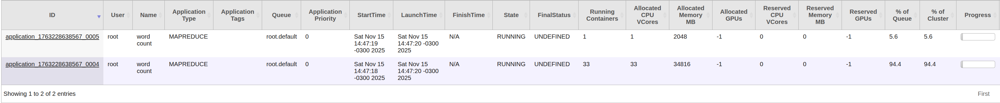
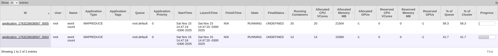
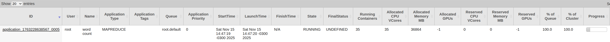
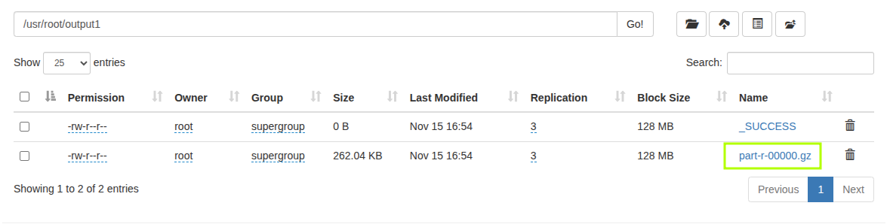

# Montagem de um cluster Hadoop com Docker Compose

## Criação do cluster Hadoop com Docker Compose

- Criei uma pasta, por exemplo `hadoop-cluster`, e dentro dela criei um arquivo chamado `docker-compose.yml` com o seguinte conteúdo:

```yaml

services:
  hadoop-master:
    image: ubuntu:24.04
    container_name: hadoop-master
    hostname: hadoop-master
    privileged: true
    tty: true
    stdin_open: true
    networks:
      hadoop-network:
        ipv4_address: 172.20.0.10
    volumes:
      - hadoop_master_data:/hadoop-data
      - ./shared:/shared
    command: /bin/bash -c "sleep infinity"

  hadoop-slave1:
    image: ubuntu:24.04
    container_name: hadoop-slave1
    hostname: hadoop-slave1
    privileged: true
    tty: true
    stdin_open: true
    networks:
      hadoop-network:
        ipv4_address: 172.20.0.11
    volumes:
      - hadoop_slave1_data:/hadoop-data
      - ./shared:/shared
    command: /bin/bash -c "sleep infinity"

  hadoop-slave2:
    image: ubuntu:24.04
    container_name: hadoop-slave2
    hostname: hadoop-slave2
    privileged: true
    tty: true
    stdin_open: true
    networks:
      hadoop-network:
        ipv4_address: 172.20.0.12
    volumes:
      - hadoop_slave2_data:/hadoop-data
      - ./shared:/shared
    command: /bin/bash -c "sleep infinity"

networks:
  hadoop-network:
    driver: bridge
    ipam:
      config:
        - subnet: 172.20.0.0/16

volumes:
  hadoop_master_data:
  hadoop_slave1_data:
  hadoop_slave2_data:
```

## Iniciar o cluster
- Dentro da pasta inicie o cluster executando o comando:

```bash
docker-compose up -d
```

## Acessar os containers

- Antes de prosseguir rode o comando `docker ps` para verificar os nomes dos containers.

- Ex na coluna: `NAMES`

-  hadoop-master

-  hadoop-slave1

-  hadoop-slave2

OBS: Os nomes dos containers podem variar, utilize os nomes corretos conforme o retorno do comando `docker ps`.

- Abra 3 terminais diferentes e acesse cada container com os comandos, neste exemplo estou utilizando os nomes dos containers conforme o exemplo acima, mas utilize os nomes corretos conforme o retorno do comando `docker ps`:

```bash
docker exec -it hadoop-master bash
docker exec -it hadoop-slave1 bash
docker exec -it hadoop-slave2 bash
```
Obs: Rode cada comando em um terminal diferente.

## Baixando e configurando o Hadoop

- Dentro de cada container, ou seja, em cada terminal, execute os seguintes comandos para baixar e configurar o Hadoop:

### Instalando o Java e o OpenSSH

```bash
apt-get update
apt install openjdk-21-jdk openssh-server
```

OBS: Provavelmente será solicitado para confirmar a instalação, digite `y` e pressione Enter, além disso pode perguntar a sua região e cidade, selecione conforme sua localidade.
- Agora precisamos localizar o JAVA_HOME. Execute, em apenas 1 terminal, o seguinte comando abaixo para encontrar o caminho do Java instalado:

```bash
whereis java
```
- O comando retornará algo como `/usr/bin/java /usr/share/java /usr/share/man/man1/java.1.gz`.
- Agora precisamos descobrir o caminho completo do Java. Execute o comando abaixo:

```bash
readlink -f /usr/bin/java ( ou o primeiro caminho retornado pelo comando anterior)
```

- O comando retornará algo como `/usr/lib/jvm/java-21-openjdk-amd64/bin/java`.
- Copiei o caminho até a parte `java-21-openjdk-amd64`, ou seja, o caminho completo do JAVA_HOME é `/usr/lib/jvm/java-21-openjdk-amd64`.
- Antes de prosseguir, instale o nano ou vim
```bash
apt install nano
```

- Agora, em cada terminal, abra o arquivo `~/.bashrc` para adicionar a variável de ambiente JAVA_HOME

```bash
nano ~/.bashrc
```

- No final do arquivo, adicione a seguinte linha (substitua o caminho pelo que você encontrou):

```bash
JAVA_HOME=/usr/lib/jvm/java-21-openjdk-amd64
PATH=$PATH:$JAVA_HOME
```
- Salve e feche o arquivo. Em seguida, execute o comando abaixo para aplicar as alterações:

```bash
source ~/.bashrc
```

- Para testar se a variável foi configurada corretamente, execute:

```bash
echo $JAVA_HOME
```
- Deve retornar o caminho que você adicionou. Ex: `/usr/lib/jvm/java-21-openjdk-amd64`

### Configurando o SSH sem senha

- Agora, em cada terminal, execute o seguinte comando para iniciar o ssh:

```bash
service ssh start
```
- Agora, em cada terminal, execute o seguinte comando e pressione Enter para todas as opções:

```bash
ssh-keygen -t rsa
```

OBS: Após rodar o comando a primeira opção que irá aparecer é o local para salvar a chave, copiei o caminho que é mostrado entre parenteses, Ex: `/root/.ssh/id_rsa`

- Em seguida, execute o comando abaixo, em cada terminal, para adicionar a chave pública ao arquivo `authorized_keys` colocando o caminho copiado anteriormente adicionando `.pub` no final:

```bash
cat ~/.ssh/id_rsa.pub >> ~/.ssh/authorized_keys
```

- Por fim, em cada terminal, execute o comando abaixo para copiar a chave pública para o localhost:

```bash
ssh-copy-id -i /root/.ssh/id_rsa.pub root@localhost
```
- Quando solicitado, digite `yes` para continuar e pressione Enter quando pedir a senha (não há senha definida, então apenas pressione Enter).

- Agora, em cada terminal, teste a conexão SSH com o comando:

```bash
ssh localhost
```

- OBS: Toda vez que você subir novamente os containers, você precisará iniciar o serviço SSH novamente com o comando `service ssh start`.

- Se tudo estiver configurado corretamente, você deverá conseguir se conectar sem precisar digitar uma senha.

- Agora, precisamos configurar o SSH sem senha entre o master e os slaves.

### Configurando o SSH sem senha entre o master e os slaves

- No hadoop-master, rode o seguinte comando para exibir a chave pública gerada anteriormente e **copie** o conteúdo exibido referente ao master:
```bash
cat ~/.ssh/id_rsa.pub
```

- No terminal de cada slave, adicione a chave copiada manualmente:

```bash
mkdir -p ~/.ssh
echo "COLE_A_CHAVE_PUBLICA_DO_MASTER_AQUI" >> ~/.ssh/authorized_keys
chmod 700 ~/.ssh
chmod 600 ~/.ssh/authorized_keys
```

- Agora teste a conexão SSH sem senha do master para os slaves:

```bash
ssh hadoop-slave1
ssh hadoop-slave2
```

- OBS: Substitua `hadoop-slave1` e `hadoop-slave2` pelos endereços IP ou nomes corretos dos slaves, se necessário.

- Agora faça o mesmo processo para os slaves se conectarem ao master e entre si:

### Configurando o SSH sem senha entre os slaves e o master

- No hadoop-slave1, rode o seguinte comando para exibir a chave pública gerada anteriormente e **copie** o conteúdo exibido referente ao slave1:

```bash
cat ~/.ssh/id_rsa.pub
```

- No terminal do master e do slave2, adicione a chave copiada manualmente:

```bash
mkdir -p ~/.ssh # Pode omitir essa linha no slave1 se ja tiver sido criado
echo "COLE_A_CHAVE_PUBLICA_DO_MASTER_AQUI" >> ~/.ssh/authorized_keys
chmod 700 ~/.ssh
chmod 600 ~/.ssh/authorized_keys
```

- Agora teste a conexão SSH sem senha do slave1 para o slave2 e para o master:

```bash
ssh hadoop-slave2
ssh hadoop-master
```

- Repita o mesmo processo para o hadoop-slave2:

- No hadoop-slave2, rode o seguinte comando para exibir a chave pública gerada anteriormente e **copie** o conteúdo exibido referente ao slave2:

```bash
cat ~/.ssh/id_rsa.pub
```
- No terminal do master e do slave1, adicione a chave copiada manualmente:

```bash
mkdir -p ~/.ssh # Pode omitir essa linha se ja tiver sido criado
echo "COLE_A_CHAVE_PUBLICA_DO_MASTER_AQUI" >> ~/.ssh/authorized_keys
chmod 700 ~/.ssh
chmod 600 ~/.ssh/authorized_keys
```

- Agora teste a conexão SSH sem senha do slave2 para o slave1 e para o master: 

```bash
ssh hadoop-slave1
ssh hadoop-master
```

### Baixando e configurando o Hadoop

- Entre na pasta opt `cd opt` em cada terminal

- Agora, em cada terminal, execute os seguintes comandos para baixar e extrair o Hadoop:

```bash
wget https://dlcdn.apache.org/hadoop/common/hadoop-3.4.2/hadoop-3.4.2.tar.gz
tar -xvzf hadoop-3.4.2.tar.gz
```

- Se quiser pode remover o arquivo tar.gz para economizar espaço:

```bash
rm hadoop-3.4.2.tar.gz
```

- Agora, em cada terminal, entre na pasta hadoop-3.4.2 e abra o arquivo etc/hadoop/core-site.xml e e atribua a porta e o hostname do nó master igual ao exemplo abaixo:

```bash
cd hadoop-3.4.2

nano etc/hadoop/core-site.xml

<configuration>
        <property><name>fs.default.name</name><value>hdfs://hadoop-master:9000</value></property>
</configuration>
```

- OBS: Nos comandos continue na pasta etc/hadoop-3.4.2

- Agora apenas no master abra o arquivo etc/hadoop/workers e adicione os nomes dos slaves:

```bash
nano etc/hadoop/workers

hadoop-slave1
hadoop-slave2
```

- Agora, abra o arquivo hadoop-env.sh em cada terminal:

```bash
nano etc/hadoop/hadoop-env.sh
```

- Encontre a parte que contém:

```bash 
# The java implementation to use. By default, this environment
# variable is REQUIRED on ALL platforms except OS X!
export JAVA_HOME= 
```

- Tire o comentário da linha que contem o `export JAVA_HOME=` e modifique-a para incluir o caminho do JAVA_HOME que você configurou anteriormente:

```bash
export JAVA_HOME=/usr/lib/jvm/java-21-openjdk-amd64
```
- No final desse mesmo arquivo, tambem adicione as seguintes linhas em cada terminal:

```bash
export HDFS_NAMENODE_USER="root"
export HDFS_DATANODE_USER="root"
export HDFS_SECONDARYNAMENODE_USER="root"
export YARN_RESOURCEMANAGER_USER="root"
export YARN_NODEMANAGER_USER="root"
```

- Agora, em cada terminal, abra o arquivo `etc/hadoop/hdfs-site.xml` e adicione o seguinte conteúdo:
```bash
<configuration>

    <!-- Define o diretorio onde o NameNode armazena seus metadados -->
    <property>
        <name>dfs.namenode.name.dir</name>
        <value>file:/opt/hadoop-3.4.2/hdfs/namenode</value>
    </property>

    <!-- Define o diretorio onde o DataNode armazena os blocos de dados -->
    <property>
        <name>dfs.datanode.data.dir</name>
        <value>file:/opt/hadoop-3.4.2/hdfs/datanode</value>
    </property>

</configuration>
```

- Então, em cada terminal, abra o arquivo `~/.bashrc` para adicionar a variável de ambiente HADOOP_HOME e atualizar o PATH, coloque no final do arquivo:

```bash
nano ~/.bashrc

export HADOOP_HOME=/opt/hadoop-3.4.2
export PATH=$PATH:$HADOOP_HOME/bin:$HADOOP_HOME/sbin

source ~/.bashrc
```


- Agora, em cada terminal, abra o arquivo `etc/hadoop/mapred-site.xml` que deve estar dentro da pasta `etc/hadoop-3.4.2` e adicione o seguinte conteúdo:


```bash
<configuration>
   <property>
        <name>mapreduce.framework.name</name>
        <value>yarn</value>
   </property>

   <property>
        <name>mapreduce.jobhistory.address</name>
        <value>hadoop-master:10020</value>
    </property>

    <property>
        <name>mapreduce.jobhistory.webapp.address</name>
        <value>hadoop-master:19888</value>
    </property>

    <property>
        <name>yarn.app.mapreduce.am.env</name>
        <value>HADOOP_MAPRED_HOME=/opt/hadoop-3.4.2</value>
    </property>

    <property>
        <name>mapreduce.map.env</name>
        <value>HADOOP_MAPRED_HOME=/opt/hadoop-3.4.2</value>
    </property>

    <property>
        <name>mapreduce.reduce.env</name>
        <value>HADOOP_MAPRED_HOME=/opt/hadoop-3.4.2</value>
    </property>

</configuration>
```

- Depois, em cada terminal, abra o arquivo `etc/hadoop/yarn-site.xml` que deve estar dentro da pasta `etc/hadoop-3.4.2` e adicione o seguinte conteúdo:

```bash

<configuration>

    <property>
        <name>yarn.resourcemanager.hostname</name>
        <value>hadoop-master</value>
    </property>

    <property>
        <name>yarn.resourcemanager.address</name>
        <value>hadoop-master:8032</value>
    </property>

    <property>
        <name>yarn.resourcemanager.scheduler.address</name>
        <value>hadoop-master:8030</value>
    </property>

    <property>
        <name>yarn.resourcemanager.resource-tracker.address</name>
        <value>hadoop-master:8031</value>
    </property>

    <property>
        <name>yarn.nodemanager.aux-services</name>
        <value>mapreduce_shuffle</value>
    </property>

    <property>
        <name>yarn.nodemanager.aux-services.mapreduce.shuffle.class</name>
        <value>org.apache.hadoop.mapred.ShuffleHandler</value>
    </property>

</configuration>

```
- Agora, em cada terminal, execute os seguintes comandos para instalar o sudo:

```bash
apt update
apt install -y sudo
echo "root ALL=(ALL) NOPASSWD:ALL" >> /etc/sudoers
```

- Então, em cada termina, execute o comando abaixo para formartar o NameNode:

```bash
hdfs namenode -format
```

### Iniciando o HDFS e criando diretórios

- Para iniciar o HDFS, execute o comando abaixo no master:

```bash
sbin/start-all.sh
```

- Inicie também o JobHistory no master com o comando:

```bash
mr-jobhistory-daemon.sh start historyserver
```

- Para verificar se os processos estão rodando, execute o comando abaixo em cada terminal:

```bash
jps
```

- No masster, você deve ver os processos NameNode, DataNode, SecondaryNameNode, ResourceManager, NodeManager e JobHistoryServer.
- Nos slaves, você deve ver os processos DataNode e NodeManager.

- Agora, abra o navegador e acesse o seguinte endereço para verificar o status do HDFS:

http://172.20.0.11:9870/dfshealth.html#tab-overview

- Assim, no terminal do master, execute os seguintes comandos para criar os diretórios necessários no HDFS:

```bash
hdfs dfs -mkdir /user
hdfs dfs -mkdir /user/root
```

- Pronto! Seu cluster Hadoop está configurado e funcionando com Docker Compose.

### Parando o cluster Hadoop

- Para parar o cluster Hadoop, execute o seguinte comando no terminal do master dentro da pasta hadoop-3.4.2:

```bash
sbin/stop-all.sh
``` 

### Parando os containers Docker
- Para parar os containers Docker, execute o seguinte comando na pasta onde está o arquivo `docker-compose.yml`:

```bash
docker-compose stop
```


### Testes e avaliação do cluster Hadoop

- Agora vamos realizar algumas alterações na configuração do cluster Hadoop e avaliar o desempenho utilizando o job de contagem de palavras (wordcount) como benchmark. Para tanto, iremos rodar simultaneamente a contagem de palavras em cada nó do cluster (master, slave1 e slave2) e analisar como as alterações impactam o desempenho.

- Para os exemplos dos testes, foi criado um arquivo txt de cerca de 10 GBs através da repetição do conteúdo do livro "Artificial Intelligence: A Modern Approach (3rd Edition)" em um arquivo chamado `Artificial-Intelligence-A-Modern-Approach-_3rd-Edition_.txt` que está localizado na pasta `/usr/root/exer1/` dentro de cada container.

- O comando utilizado para rodar o job de contagem de palavras utilizado foi o seguinte:

```bash
time hadoop jar $HADOOP_HOME/share/hadoop/mapreduce/hadoop-mapreduce-examples*.jar wordcount /usr/root/exer1/Artificial-Intelligence-A-Modern-Approach-_3rd-Edition_.txt /usr/root/exer1/output
```
- OBS: Mude apenas a pasta de output para  /usr/root/exer1/output1 no master, /usr/root/exer1/output2 no slave1 e /usr/root/exer1/output3 no slave2.

#### Teste 1: Alterando a quantidade de memoria e a quantidade de vcores do yarn 

- Inicialmente vamos aumentar a quantidade de memória e vCores alocados para cada NodeManager do YARN. Para isso, abra o arquivo `etc/hadoop/yarn-site.xml` em cada terminal e adicione as seguintes configurações:

```bash
   <property>
        <name>yarn.nodemanager.resource.memory-mb</name>
        <value>12288</value>
   </property>

   <property>
        <name>yarn.nodemanager.resource.cpu-vcores</name>
        <value>12</value>
   </property>

   <property>
        <name>yarn.scheduler.maximum-allocation-mb</name>
        <value>122888</value>
   </property>
```

- No meu cenário, ao rodar o contador de palavras nos 3 terminais simultaneamente, observei o seguinte comportamento:

- O YARN alocou mais recursos para os contaiers, o que permitiu executar 2 tarefas simultaneamente

- Inicialmente o master e o slave1 começaram a executar os seus jobs de forma simultânea, embora o slave1 tenha ficado com poucos recursos inicialmente, enquanto isso o slave2 ficou aguardando a liberação de recursos para iniciar a execução do job.

- Após o término do job no master, o slave1 ficou executando sozinho e depois o slave2 iniciou a execução do seu job simultaneamente, aproveitando os recursos liberados pelo master.

- Após o término do job no slave1, o slave2 continuou executando sozinho até o final do job.

- Todo esse processo pode ser visto nas seguintes imagens dos recursos do YARN:







- Tempo de execução do job com as configurações alteradas:

```bash
Master: real  4m35.339s
Slave1: real  8m9.315s
Slave2: real  11m2.939s
```

- A titulo de comparação vamos retirar as adições que foram feitas no arquivo `etc/hadoop/yarn-site.xml` em cada terminal e analisar o tempo de execução do job novamente:

- OBS: Toda vez que você alterar a configuração do YARN, é necessário reiniciar o cluster Hadoop para que as alterações tenham efeito. Para isso, pare o cluster com o comando `sbin/stop-all.sh` no master e inicie novamente com o comando `sbin/start-all.sh`.

- Tempo de execução do job com as configurações padrão do YARN:

```bash
Master: real  3m43.488s
Slave1: real  7m25.187s
Slave2: real  11m6.740s
```

- OBS: Os tempos vistos logo acima serão utilizados para comparação com os próximos testes, pois essa configuração é a padrão do YARN e vamos alterar outras configurações nos próximos testes.

- Nesse cenário, cada nó executou o job de forma sequencial, podemos ver uma diferença significativa no tempo do master e do slave1, enquanto o slave2 teve um tempo similar ao do teste anterior.

- Logo baixo temos as imagens dos recursos do YARN nesse cenário, como cada nó executou o job de forma sequencial, não houve muita variação nos recursos utilizados:


Conclusão do teste:

- Aumentar a quantidade de memória e vCores alocados para cada NodeManager do YARN permitiu que os nós executassem os jobs de forma mais eficiente, aproveitando melhor os recursos disponíveis no cluster. No entanto, o impacto no tempo de execução pode variar dependendo da carga de trabalho e da configuração específica do cluster.

#### Teste 2: Alterando o escalonador do YARN para Fair Scheduler

- Agora, vamos rodar o contador de palavras utilizando o escalonador FairScheduler, mas antes é precido configurar o YARN, então abra o arquivo `etc/hadoop/yarn-site.xml` em cada terminal e adicione a seguinte configuração:

```bash
  <property>
    <name>yarn.resourcemanager.scheduler.class</name>
    <value>org.apache.hadoop.yarn.server.resourcemanager.scheduler.fair.FairScheduler</value>
  </property>
```

- e tambem crie o arquivo `fair-scheduler.xml` em cada terminal dentro da pasta `etc/hadoop-3.4.2/etc/hadoop/` com o seguinte conteúdo:

```xml
<?xml version="1.0"?>
<allocations>
  <queue name="default">
    <minResources>1024 mb,1vcores</minResources>
    <maxResources>8192 mb,8vcores</maxResources>
    <maxRunningApps>50</maxRunningApps>
    <weight>1.0</weight>
    <schedulingPolicy>fair</schedulingPolicy>
  </queue>
  
  <queuePlacementPolicy>
    <rule name="specified" create="false"/>
    <rule name="default" queue="default"/>
  </queuePlacementPolicy>
</allocations>
```

- O fair scheduler distribui os recursos de forma mais equitativa entre os nós do cluster. Assim, para o meu cenário, ao rodar o contador de palavras nos 3 terminais simultaneamente, observei o seguinte comportamento:

- Inicialmente o master e o slave1 começaram a executar os seus jobs de forma simultânea com a mesma quantidade de recursos, enquanto isso o slave2 ficou aguardando a liberação de recursos para iniciar a execução do job.

- Imagens dos recursos do YARN durante a execução do job com o Fair Scheduler:


- Os tempos encontrados foram os seguintes:
```bash
Master: real    14m31.852s
Slave1: real    14m29.008s
Slave2: real    19m18.940s
```

Conclusão do teste:

- Como os dois primeiros nóse xecutaram simultaneamente com a mesma quantidade de recursos, os tempos ficaram muito próximos, já o slave2 teve que aguardar um pouco mais para iniciar a execução do job, o que resultou em um tempo maior.

- Vemos esses tempos maiores em relação aos testes anteriores, pois na configuração do Fair Scheduler que fizemos alocamos menos recursos para cada nó, o que impactou diretamente no tempo de execução dos jobs.

### Teste 3: Alterando o tamanho dos blocos HDFS

- Antes de prosseguirmos retorne ao escalonador padrão do YARN, retirando a configuração do Fair Scheduler do arquivo `etc/hadoop/yarn-site.xml` e removendo o arquivo `fair-scheduler.xml` de cada terminal.

- Agora vamos alterar o tamanho dos blocos do HDFS para 256MB com o objetivo de verificar se isso impacta no desempenho do job de contagem de palavras.

- Para isso abra o arquivo `etc/hadoop/hdfs-site.xml` em cada terminal e adicione a seguinte configuração:

```bash
    <property>
        <name>dfs.blocksize</name>
        <value>268435456</value> <!-- 256MB em bytes -->
    </property>
```

- Tempo de execução do job com o tamanho de bloco alterado:

```bash
Master: real    3m21.214s
Slave1: real     7m1.207s
Slave2: real    10m38.935s
```

- Vale lembrar que os nós foram executados de forma sequencial nesse cenário, assim como no teste1 com as configurações padrão do YARN.

- Além disso, para mostrar que a configuração foi aplicada corretamente, subi um pequeno arquivo de teste para o HDFS e verifiquei o tamanho dos blocos:


- Nela podemos ver 2 arquivos, o primeiro é o arquivo grande utilizado para o job de contagem de palavras e o segundo é o arquivo de teste que subi. Podemos ver que o novo arquivo foi dividido em blocos de 256MB conforme a configuração que fizemos, enquanto o arquivo grande foi dividido em blocos de 128MB, que é o tamanho padrão do HDFS.

Conclusão do teste:

- Alterar o tamanho dos blocos do HDFS para 256MB resultou em uma certa melhoria no tempo de execução do job de contagem de palavras comparado com o exemplo padrão executado no teste1, entretado não foi tão significativa. Isso se deve ao fato de que o tamanho dos blocos não é o único fator que influencia o desempenho do Hadoop. Outros fatores, como a configuração do YARN, a carga de trabalho e a eficiência do código MapReduce, também desempenham um papel importante.

- Além disso, o tamanho dos blocos é pensado para otimizar o armazenamento e a transferência de dados no HDFS, mas nem sempre isso se traduz em melhorias de desempenho para todos os tipos de jobs.

### Teste 4: Habilitando compressão automática de dados do MapReduce

- Retorne ao tamanho padrão dos blocos do HDFS, ou seja, remova a configuração adicionada no teste anterior do arquivo `etc/hadoop/hdfs-site.xml` em cada terminal.

- Vamos habilitar a compressão automática dos dados do MapReduce para reduzir o tamanho dos dados transferidos entre as fases de map e reduce. Para isso, abra o arquivo `etc/hadoop/mapred-site.xml` em cada terminal e adicione as seguintes configurações:


```bash
<property>
    <name>mapreduce.output.fileoutputformat.compress</name>
    <value>true</value>
</property>

<property>
    <name>mapreduce.output.fileoutputformat.compress.codec</name>
    <value>org.apache.hadoop.io.compress.GzipCodec</value>
</property>
```

- Tempo de execução do job com a compressão habilitada:

```bash
Master: real    7m19.695s
Slave1: real    3m41.978s
Slave2: real    11m0.212s
```

- OBS: Cada nó executou de forma serial e o slave1 foi o primeiro nó a ser executado nesse cenário, por isso o tempo menor.

- Na iamgem abaixo podemos ver que os arquivos de saída do job de contagem de palavras estão comprimidos no formato Gzip:



Conclusão do teste:

- Habilitar a compressão automática dos dados do MapReduce não resultou em diferenças significativas no tempo de execução do job, as diferenças vistas provavelmente se devem a variações normais na carga de trabalho do cluster.

- No entanto, a compressão pode ser benéfica em cenários onde a largura de banda da rede é um gargalo, pois reduz a quantidade de dados transferidos entre os nós do cluster. Além disso, a compressão pode economizar espaço em disco, o que é útil em clusters com armazenamento limitado.

### Teste 5: Aumentando a porcentagem máxima de uso de disco antes do nó ficar unhealthy

- Por padrão o Yarn marca o NodeManager como unhealthy quando o uso do disco atinge 90%. Vamos aumentar esse limite para 95% para permitir que os nós utilizem mais espaço em disco antes de serem considerados unhealthy. Para isso, abra o arquivo `etc/hadoop/yarn-site.xml` em cada terminal e adicione a seguinte configuração:


```bash
<property>
    <name>yarn.nodemanager.disk-health-checker.max-disk-utilization-per-disk-percentage</name>
    <value>98.0</value>
</property>

<property>
    <name>yarn.nodemanager.disk-health-checker.min-free-space-per-disk-mb</name>
    <value>0</value>
</property>
```

- Essa mudança não afeta diretamente o desempenho do cluster Hadoop, mas permite que os nós utilizem mais espaço em disco, o que pode ser benéfico em cenários onde o espaço em disco é um recurso limitado. No entanto, é importante monitorar o uso do disco para evitar problemas de desempenho ou falhas no sistema.

-----
acréscimo de nós ?

É mesmo possível melhorar o desempenho da aplicação pelo
qual o nível de tolerância a faltas suportado pela aplicação no Hadoop ?

### Teste de tolerância a falhas e performance de aplicações Hadoop

- Nesse sessão vamos tentar responder 2 pertuntas importantes relacionadas ao desempenho e à tolerância a falhas em um cluster Hadoop:

1. É possível melhorar o desempenho da aplicação aumentando o número de nós no cluster Hadoop?

2. Qual o nível de tolerância a falhas suportado pela aplicação no Hadoop?

- Para responder a primeira pergunta vamos roda apenas uma vez a aplicação de contagem de palavras (wordcount) em 2 cenários diferentes: primeiro com 3 nós (1 master e 2 slave) e depois com 1 nós (1 master). Em ambos os cenários, utilizaremos o mesmo arquivo de entrada de aproximadamente 10 GBs.

- No cenário com 3 nós, o tempo de execução do job foi o seguinte:

```bash
real 3m27.321s
```

- No cenário com 1 nó, o tempo de execução do job foi o seguinte:

```bash
real  4m57.309s
```

Conclusão do teste:

- Aumentar o número de nós no cluster Hadoop resultou em uma melhoria significativa no desempenho da aplicação de contagem de palavras. Com 3 nós, o tempo de execução foi consideravelmente menor em comparação com o cenário de 1 nó. Isso demonstra a capacidade do Hadoop de distribuir a carga de trabalho entre múltiplos nós, aproveitando o paralelismo para acelerar o processamento dos dados.

- Além disso, a utilização de múltiplos nós permite que o Hadoop gerencie melhor os recursos do sistema, como CPU, memória e I/O de disco, o que contribui para um desempenho geral mais eficiente. Portanto, em ambientes onde o volume de dados é grande e o tempo de processamento é crítico, aumentar o número de nós no cluster Hadoop é uma estratégia eficaz para melhorar o desempenho das aplicações.

- Para responder a segunda pergunta, vamos simular uma falha em um dos nós durante a execução do job de contagem de palavras no cenário com 3 nós. Para isso, iniciaremos o job e, após alguns segundos, pararemos um dos slaves utilizando o comando `docker stop hadoop-slave2` em outro terminal.

Conclusão do teste:

- Durante a execução do job, após parar o slave2, o Hadoop detectou a falha entretanto a aplicação congelou e não conseguiu completar o processamento dos dados. O job foi interrompido e não foi possível obter um resultado final.

- Não tenho certeza se isso ocorreu devido a alguma configuração específica do cluster ou se é um comportamento esperado do Hadoop em relação à tolerância a falhas. Em geral, o Hadoop é projetado para ser tolerante a falhas, mas a capacidade de recuperação pode depender do tipo de job e das configurações do cluster.


### Vantagens e Desvantagens do Uso de um Ambiente Hadoop

- O ecossistema Hadoop oferece uma infraestrutura robusta para processamento distribuído de grandes volumes de dados. No entanto, assim como qualquer tecnologia, sua adoção envolve pontos positivos e limitações que devem ser avaliados conforme o contexto da organização.

#### Vantagens

Uma de suas principais vantagens é a escalabilidade horizontal, que permite expandir a capacidade do cluster de forma gradual e econômica através da simples adição de novos nós, sem a necessidade de investir em hardware especializado. Esta escalabilidade é complementada pela robusta tolerância a falhas do sistema, onde o HDFS (Hadoop Distributed File System) replica automaticamente os blocos de dados entre os nós, garantindo alta disponibilidade e recuperação automática em caso de falhas de máquinas, assegurando a continuidade das operações.

Do ponto de vista econômico, o Hadoop se caracteriza pelo baixo custo de implantação, já que foi projetado para operar em hardware comum, contrastando favoravelmente com soluções proprietárias de alto desempenho que demandam investimentos substancialmente maiores. Essa economicidade não compromete a eficiência, graças ao processamento distribuído altamente eficiente habilitado pelo modelo MapReduce e pelo gerenciador de recursos YARN, que permitem processar terabytes ou petabytes de dados de forma paralelizada, otimizando o desempenho em cargas de trabalho massivas.

Finalmente, o Hadoop se consolida como um ecossistema completo através de seu rico conjunto de ferramentas integradas, que facilitam a construção de pipelines end-to-end de Big Data. Ferramentas como Hive para consultas SQL, Spark para processamento rápido, HBase para banco de dados NoSQL distribuído, e Kafka e Flume para ingestão de dados, oferecem uma solução abrangente e integrada para as diversas necessidades do ciclo de vida dos dados, consolidando o Hadoop como uma plataforma versátil e poderosa para o ambiente de dados em larga escala.

#### Desvantagens

Apesar de suas vantagens no processamento de Big Data, o Hadoop apresenta alguns desafios significativos que devem ser considerados em sua adoção. Um dos principais obstáculos é a curva de aprendizado elevada, uma vez que a configuração e manutenção de clusters Hadoop demandam conhecimento especializado em sistemas distribuídos, redes, configuração avançada de Linux e tuning de componentes como HDFS e YARN, o que consequentemente aumenta os custos operacionais iniciais.

Outra limitação importante diz respeito à latência em determinados tipos de processamento. O modelo tradicional do Hadoop baseado em MapReduce não é adequado para cenários que exigem consultas interativas, processamento em tempo real ou análises de baixa latência, sendo mais indicado o uso de ferramentas como Spark ou bancos de dados distribuídos específicos para esses casos.

A manutenção trabalhosa é outro ponto crítico, envolvendo atividades constantes como monitoramento de nós ativos, tratamento de falhas, ajuste de parâmetros de replicação e gerenciamento de segurança e permissões, demandando equipes especializadas e dedicadas.

Por fim, é importante considerar que o Hadoop pode ser excessivo para pequenas cargas de dados. Para projetos que envolvem volumes na casa de gigabytes ou operações relativamente simples, a plataforma pode introduzir mais complexidade do que benefícios reais. Nestes cenários, soluções alternativas como PostgreSQL, Pandas ou mesmo Spark em modo standalone costumam ser mais eficientes e práticas.


#### Conclusão

Em conclusão, o Hadoop se consolida como uma solução extremamente poderosa para o processamento distribuído de grandes volumes de dados, oferecendo vantagens significativas em escalabilidade horizontal, tolerância a falhas, custo-benefício e eficiência no processamento massivo de dados, além de contar com um ecossistema maduro de ferramentas integradas. No entanto, sua adoção deve ser cuidadosamente avaliada, considerando que a complexidade de configuração e manutenção, a latência em processamentos interativos, o alto consumo de recursos e a necessidade de equipes especializadas podem representar desafios substanciais